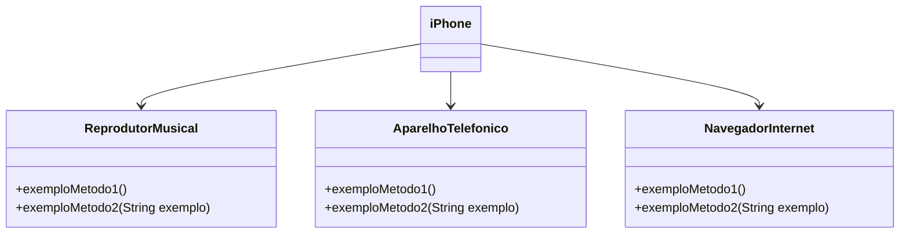

## Getting Started

Welcome to the VS Code Java world. Here is a guideline to help you get started to write Java code in Visual Studio Code.

## Folder Structure

The workspace contains two folders by default, where:

- `src`: the folder to maintain sources
- `lib`: the folder to maintain dependencies

Meanwhile, the compiled output files will be generated in the `bin` folder by default.

> If you want to customize the folder structure, open `.vscode/settings.json` and update the related settings there.

## Dependency Management

The `JAVA PROJECTS` view allows you to manage your dependencies. More details can be found [here](https://github.com/microsoft/vscode-java-dependency#manage-dependencies).

<h1 algin = "center">
Desafio Iphone
</h1>

<b><i>
Modelagem e diagramação da representação em UML e Código no que se refere ao componente iphone.
<b><i>

## 💡 Modelando e Diagramação de um Componente iPhone
- Neste desafio, você será responsável por modelar e diagramar a representação UML do componente iPhone, abrangendo suas funcionalidades como Reprodutor Musical, Aparelho Telefônico e Navegador na Internet.

## 💡 Contexto
- Com base no video de lançamento do iphone, elabore em uma ferramenta da UML de sua preferência a
diagramação das classes e interfaces com a proposta de representar os papéis do iphone de:
Reprodução Muusical, Aparelho Telefônico e Navegador na internet. Em seguida crie as classes e interfaces no formato de arquivos .java
   

## 📁 Estrutura/
- [DesafioIphone](https://github.com/raphael690/DesafioIphone.git)/
Pasta com projeto

###### Comportamentos esperados:
* Reprodutor Musical : tocar(), pausar(), selecionarMusica(String musica)
* Aparelho Telefônico : ligar(String numero), atender(), iniciarCorreioVoz()
* Navegador na Internet: exibirPagina(String url), adicionarNovaAba(), atualizarPagina()

###### Objetivo

### Exemplo de Diagrama UML 

## 🔧 Tecnologias
![JAVA]

## 🔗 Referências
- Video aulas do Bootcamp Santander 2024 - Backend com Java

## ✅ Feedback

 Desenvolvido por Raphael Ferreira
